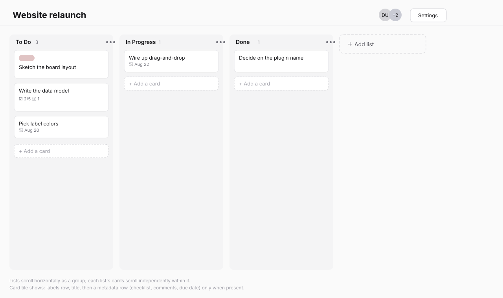
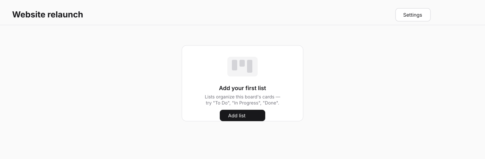
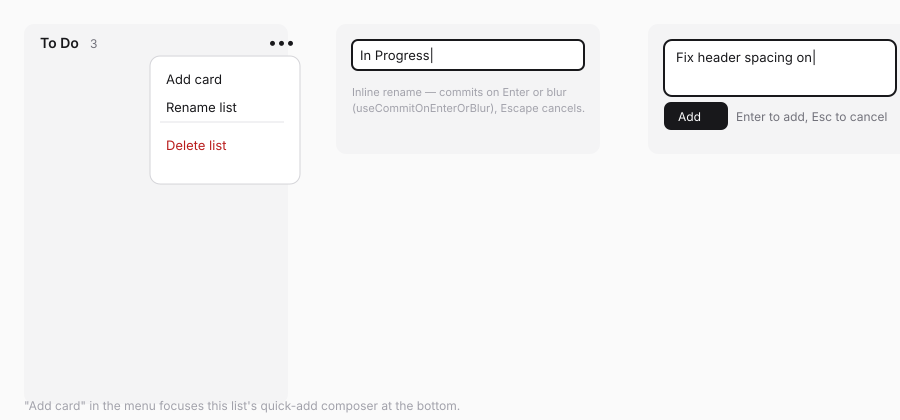
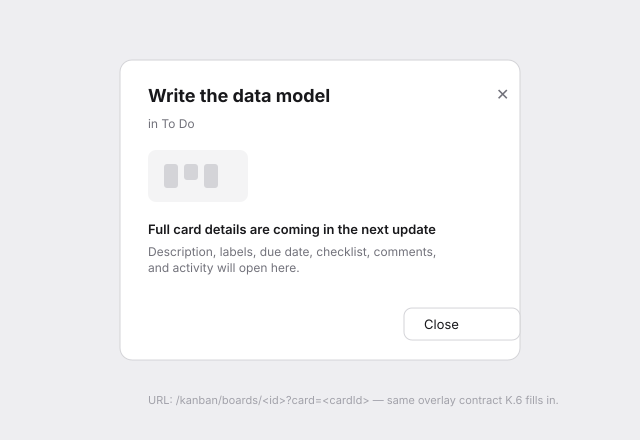

# Board View — layout, lists & quick-add (K.5 design spec)

> Wireframe-before-build spec per the `sv-ui-design` workflow. Wireframes in
> [`board-view/`](board-view/). Scope matches SPEC's K.5: the board screen
> rendering real data, everything except drag (K.7) and the real card modal
> (K.6).

## Problem

Opening a board must show its lists and cards, let a user add lists/cards
and rename lists, and give every card a working (if minimal) click target —
without inventing dead controls or a second interaction model K.6/K.7 will
have to unwind.

## Direction

Horizontal row of lists (Trello-like), each an independent vertical scroll
region with a header (name, card count, `•••` menu), its cards, and a
bottom quick-add composer. Board header carries the board name, a member
avatar stack, and a real **Settings** action (reuses K.3's `updateBoard`).
Cards open a minimal, URL-addressable placeholder overlay — not a dead
click — that K.6 fills in without changing the routing contract.

## Jargon table

Unchanged from K.4 — no new internal terms surface here.

## Screens

### 1. Board, populated — `board-view/01-board-populated.svg`

- Header: board name, avatar stack (first 2 members + `+N` overflow),
  **Settings**.
- Each list: header (name, card count, `•••`), cards, quick-add composer
  pinned at the bottom (Trello convention — the newest card lands next to
  where you're already looking).
- Card tile: label chips row (if any) → title → a metadata row shown only
  when non-empty (checklist `done/total`, comment count, due date icon+date).
  No metadata row at all when a card has none of these — never an empty row.
- Trailing **Add list** dashed slot, same visual language as K.4's "New
  board" card.

### 2. Board, empty — `board-view/02-board-empty.svg`

`EmptyState`-style centered panel: "Add your first list" + one action.
Shown only when the board has zero lists (a board can't have cards without
a list, so this is the only empty state this screen needs).

### 3. List menu, inline rename, quick-add focus — `board-view/03-list-menu-and-quickadd.svg`

- `•••` opens `Menu`: **Add card** (focuses/scrolls to that list's quick-add
  composer — not a second creation path), **Rename list**, separator,
  **Delete list** (destructive).
- Rename is inline (the list name becomes an `Input` in place), committing
  via `useCommitOnEnterOrBlur`; Escape cancels and restores the prior name.
- Quick-add composer: `Textarea`-style single-line input, Enter or the
  **Add** button submits, Escape cancels, stays focused for rapid successive
  adds (matches Trello's fast-entry pattern).

### 4. Card placeholder overlay — `board-view/04-card-placeholder-overlay.svg`

Single click opens `?card=<id>` as a `Dialog` (`sm`) showing the real title,
its list, and an honest "Full card details are coming in the next update"
note — the same board-stub pattern K.4 used for the board route itself, so
nothing here is a dead end. K.6 replaces the body only; the route, the
`?card=` param, and the open/close wiring stay exactly as built here.

## States checklist

- **Empty:** screen 2 (zero lists).
- **Populated:** screen 1, including a list with zero cards (quick-add
  composer alone, no card tiles) and a card with no metadata (title only).
- **Pending:** quick-add and rename inputs disable/show a subtle pending
  state while their action is in flight; Settings dialog reuses K.4's
  dialog pending pattern ("Saving…").
- **Error (expected):** rename/quick-add failures surface via `useToast`
  (inline error has no natural home in an inline-edit control); Settings
  dialog uses the same inline-error pattern as K.4's dialogs.
- **Error (unexpected):** covered by the plugin's existing `app/error.tsx`.
- **Degraded:** n/a.

## Engineering notes

- **DS gap check: no gap.** New composition (list column, card tile,
  horizontal board row) is plugin-specific domain layout, not a reusable DS
  pattern — consistent with SPEC's own call that the board layout is
  hand-built, only drag-and-drop borrows a library (dnd-kit, K.7). Controls
  used: `PageContainer`, `Typography`, `Menu`, `Input`, `Badge` (label
  chips), `Avatar`, `Button`, `Icon`, `Dialog`, `EmptyState`, `useToast`,
  `useCommitOnEnterOrBlur`.
- **No dead controls (K.4 precedent applied here too):**
  - **Search** (SPEC: "wired in K.10") is **omitted** from this screen
    entirely rather than rendered inert — same treatment as K.4's Inbox nav
    entry. It appears in K.10.
  - **Share** is **omitted** until K.9 gives it real membership data to act
    on (same reasoning as K.4).
  - **Settings** is **not** stubbed — it's real now, reusing K.3's
    `updateBoard` action for name/color, because that action already
    exists and the dialog is a near-duplicate of K.4's board-edit pattern.
  - **Card click** is a real, URL-addressable overlay with real content
    (the card's title), not a no-op — matches the explicit placeholder
    precedent SPEC already sanctions for K.13's mobile card tap.
- **Card metadata row visibility** is computed per-card (labels present?
  checklist non-empty? comments > 0? due date set?) — a card with none of
  these renders title-only, never an empty metadata strip.
- **List/card ordering** for this task is read-only (whatever `position`
  order the K.3 queries return); K.7 adds drag. No manual reorder controls
  are introduced here to later collide with drag.
- **Mobile:** out of scope (K.13); this screen is web-only for now and must
  not regress `useIsMobile`/`ResponsiveSurface` gating already in place from
  K.4's layout.

## Open questions

None — access model, card fields shown, and the placeholder-overlay pattern
are all already decided (SPEC + K.4 precedent).

## Phasing

Single phase (K.5). K.6 (card modal) and K.7 (drag) both build directly on
top of what's shipped here without changing this screen's structure.
