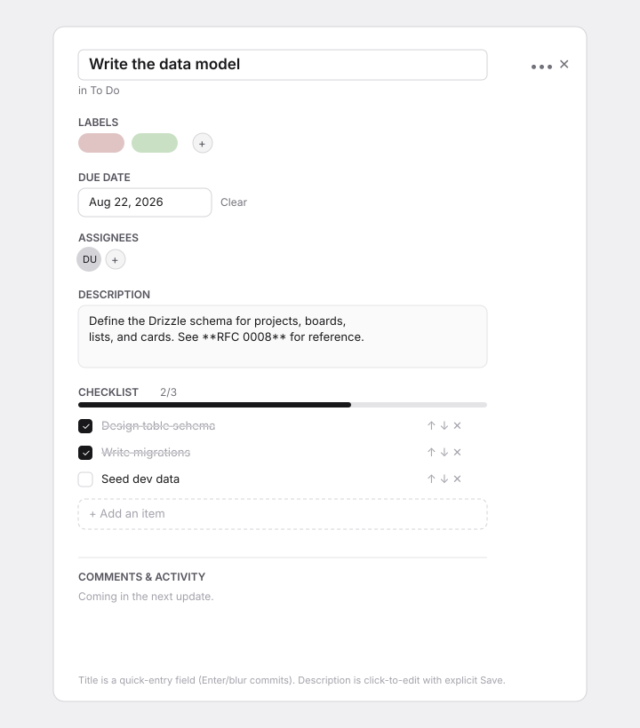
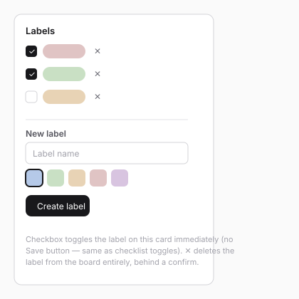

# Card Detail Modal — core fields (K.6 design spec)

> Compact wireframe-before-build spec. Unlike K.4/K.5, the overlay
> **container** (`Dialog`, the `?card=<id>` routing contract, open/close
> behavior including the deep-link-safe close) was already designed and
> signed off in K.5's [board-view.md](board-view.md) and is **not**
> revisited here — this task only fills in the modal's body. Wireframes in
> [`card-detail/`](card-detail/).

## Direction

One `Dialog` (`lg`), sections top to bottom: editable title → list
breadcrumb + card `•••` menu (Delete card) → Labels → Due date → Assignees →
Description → Checklist → an honest "Comments & Activity — coming in the
next update" note (K.8 fills this in, same placeholder precedent as K.4/K.5).

## Screens

### 1. Populated card modal — `card-detail/01-card-modal-populated.svg`

### 2. Label picker — `card-detail/02-label-picker.svg`

Assignee picker follows the identical shape (checkbox list in a `Popover`,
no create-new-entity step — board membership isn't managed here, that's
K.9).

## Field-by-field interaction decisions

| Field       | Commit model                                                                                                                                                                                        |
| ----------- | ---------------------------------------------------------------------------------------------------------------------------------------------------------------------------------------------------- |
| Title       | Quick-entry `Input`, no visible submit button → **must** use `useCommitOnEnterOrBlur` per the platform's mandatory rule (this is exactly the iOS-Done-button case it exists for).                     |
| Description | Click-to-edit: rendered `Markdown` (or a muted "Add a description…" prompt) by default; click reveals a `Textarea` with explicit **Save**/**Cancel** — has its own always-visible submit button, so the blur-commit rule's exception applies (losing focus while reading a long draft must not silently commit/discard it). |
| Due date    | `DatePicker` (`Popover` on desktop) + a **Clear** action next to it — `DatePicker` itself has no null/clear state.                                                                                    |
| Labels      | `Popover` checkbox list (toggle = immediate action call, matches checklist-toggle semantics — no separate save step for a boolean). Inline "New label" form has its own **Create label** button.     |
| Assignees   | Same `Popover` checkbox-list pattern as labels.                                                                                                                                                        |
| Checklist   | Checkbox toggle is immediate. New-item composer reuses K.5's quick-add pattern (visible Add button → the documented blur-collapses-without-committing exception). Reorder is **up/down buttons**, not drag — full drag-and-drop is K.7's board-level scope; introducing a second, checklist-local DnD implementation ahead of that is scope creep this task doesn't need. |

## Identity limitation (documented, not silently faked)

`sdk.directory` isn't wired until K.9 — assignees/board-members are shown by
`userId` only, with **"You"** substituted when the id matches the current
session's own user (the one identity this task can resolve honestly, via
`sdk.auth.getSession()`). No fabricated names/avatars for other ids. Given
no invite flow exists before K.9 either, a board today only ever has one
real member in practice, so this is a real but currently narrow gap — not a
blocker, and it self-resolves when K.9 lands.

## Engineering notes

- **Card detail fetch moves server-side, not client-fetched.** `page.tsx`
  reads the `card` search param (Next 15 async `searchParams`) and calls the
  existing `getCardDetail()` query (K.3) alongside the board query, passing
  `cardDetail: CardDetail | null` down through `BoardView` →
  `CardDetailOverlay`. A `<Link href="?card=id">` navigation in the App
  Router re-invokes the Server Component tree (fresh RSC fetch) even without
  a full reload, so this needs no client-side loading state or a new
  "fetch on demand" server action — it's the same server-first shape K.4/K.5
  already use, just re-triggered by the search param changing. An unknown
  or inaccessible id renders nothing (dialog stays closed), same as today's
  placeholder — never a 404, since the board itself is still valid.
- **New server actions** (all follow the existing `requireCardAccess`/
  `requireListAccess`-style per-resource authz): `createLabel`,
  `deleteLabel`, `toggleCardLabel`, `assignMember`, `unassignMember`,
  `createChecklistItem`, `toggleChecklistItem`, `renameChecklistItem`,
  `deleteChecklistItem`, `moveChecklistItem` (up/down neighbor swap, no
  midpoint math needed for a swap-based reorder). Label **rename** is out of
  scope for K.6 (create/toggle/delete round out the core workflow; rename is
  a cheap fast-follow, not blocking).
- **DS gap check: no gap.** `Dialog`, `DatePicker`, `Checkbox`, `Popover`,
  `Markdown`, `Menu`, `ConfirmDialog`, `Input`, `Textarea`, `Avatar`,
  `Typography`, `Icon`, `useCommitOnEnterOrBlur`, `useToast` cover
  everything; the label/assignee picker body is plugin-specific data
  (colored board-scoped entities), same justified custom-composition
  precedent as K.4/K.5's board-color palette and board/list/card layout.
- **Activity recording** stays scoped to card-level events already in
  SPEC's vocabulary (`label.added/removed`, `assignee.added/removed`,
  `due.changed`, `checklist.changed`, `field.changed`) — board-scoped label
  *creation/deletion* isn't a card event and doesn't get its own activity
  type.

## States checklist

- **Empty:** no labels/due date/assignees/description/checklist — each
  section shows its own minimal empty affordance (no chips, "Add a
  description…", no progress bar), never a missing section.
- **Populated:** screen 1.
- **Pending:** every mutation disables its own control and/or shows a
  toast-reported error on failure (`useToast`, matching K.5); Save/Create
  buttons flip to a loading state via `Button`'s `loading` prop.
- **Error (expected):** `useToast` for inline widgets (labels, checklist,
  assignees, due date — no natural inline-error slot); description
  Save shows an inline error the same way K.4/K.5's dialogs do (it already
  has a form-like Save/Cancel shape).
- **Error (unexpected):** covered by the plugin's existing `app/error.tsx`.

## Phasing

Single phase (K.6). Comments/Activity (K.8) and drag (K.7) are explicitly
out of scope and left as the placeholder note / up-down buttons
respectively, per SPEC's own task boundaries.
