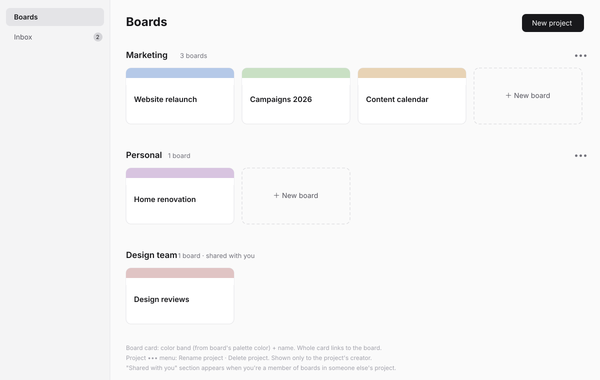
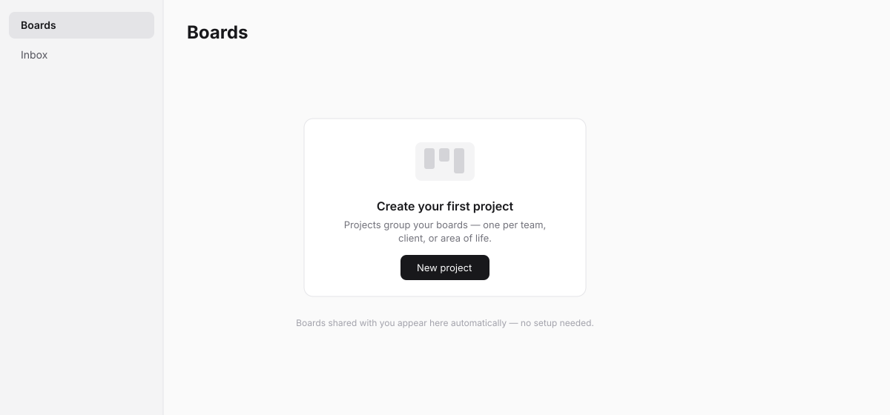
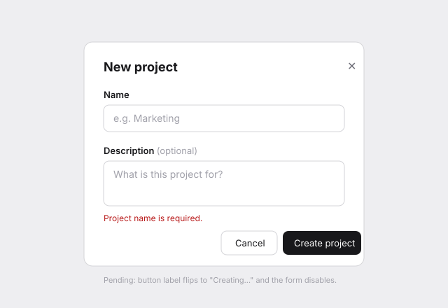
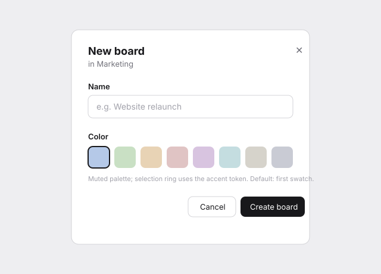
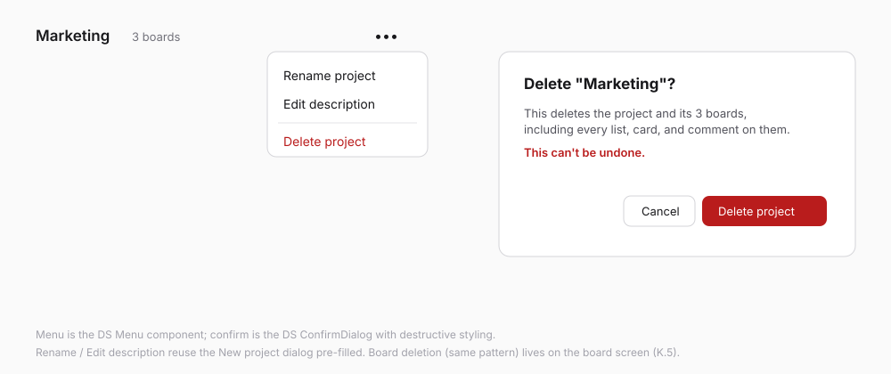

# Web Home — boards overview (K.4 design spec)

> Wireframe-before-build spec per the `sv-ui-design` workflow. Wireframes in
> [`web-home/`](web-home/). Kept inside the plugin (not the platform's
> `docs/adhoc/`) because this plugin is externally-maintained.

## Problem

The plugin's entry point must let a user see every board they can open,
grouped by project, and create projects/boards — matching CONCEPT.md's
Trello-boards-screen direction while staying visually minimal and native to
the Sovereign DS.

## Direction

Two-column web layout: a narrow plugin sidebar (Boards / Inbox) and a main
area of project sections, each a grid of board cards ending with a dashed
"New board" card. Single-click everywhere; all creation/edit flows in
dialogs; destructive flows through `ConfirmDialog` with consequence-stating
copy.

## Jargon table

| Internal            | User sees                                        |
| ------------------- | ------------------------------------------------ |
| plugin              | app (never shown here; page title is "Boards")   |
| `board_members` row | "shared with you"                                |
| tenant/creator      | (never shown)                                    |
| board `color`       | "Color" (swatch picker, no hex/token vocabulary) |

## Screens

### 1. Home, populated — `web-home/01-home-populated.svg`

- Sidebar: **Boards** (active) and **Inbox** with unread count. Inbox is
  K.11 — until it ships the entry is **not rendered** (no dead nav).
- `PageHeader` "Boards" + primary **New project** button.
- Project section header: name, muted board count, `Menu` (creator only):
  Rename project / Edit description / Delete project.
- Board card: color band + name, whole card is the link. Trailing dashed
  **New board** card (creator only — board creation is a project-creator
  operation per K.3's access model).
- Projects the user doesn't own but has member boards in render as
  "shared with you" sections: no menu, no New board card.

### 2. Home, empty — `web-home/02-home-empty.svg`

`EmptyState`: "Create your first project" + one action, plus the
invited-user line ("Boards shared with you appear here automatically").
Shown only when there are no own projects **and** no member boards.

### 3. New project dialog — `web-home/03-new-project-dialog.svg`

Name (required) + optional description. Expected failures render inline via
`useActionState`; pending label "Creating…".

### 4. New board dialog — `web-home/04-new-board-dialog.svg`

Name + 8-swatch muted color palette (first preselected). Subtitle names the
project.

### 5. Project menu + delete confirm — `web-home/05-project-menu-delete.svg`

Delete copy states the blast radius (boards, lists, cards, comments) and
irreversibility.

## States checklist

- **Empty:** screen 2 (both flavours covered by the shared-boards line).
- **Populated:** screen 1, including the not-creator section variant and a
  project with zero boards (grid shows only the New board card).
- **Pending:** dialog buttons flip label + disable inputs.
- **Error (expected):** inline in dialogs, input preserved.
- **Error (unexpected):** plugin ships `app/error.tsx` (added in this task).
- **Degraded:** n/a — one data source; loading gated by `loading.tsx`
  skeleton.

## Engineering notes

- **Board colors are data, not tokens.** The DS is deliberately monochrome —
  no decorative color tokens exist. The palette is a curated TS constant
  (8 muted hexes with names, e.g. "Sky"), stored on the board row and
  rendered via inline `style`. No color literals enter CSS files; labels
  (K.6) will reuse the same palette module.
- **DS gap check: no gap.** Sidebar nav is a plugin-local token-styled nav
  list — same precedent as Console's plugin-local section nav strip.
  Everything else consumes `@sovereignfs/ui` (`PageContainer`, `PageHeader`,
  `Dialog`, `Menu`, `ConfirmDialog`, `EmptyState`, `Button`, `Input`,
  `Textarea`, `FormField`, `Spinner`).
- **Deviation from SPEC K.4:** SPEC allowed stubbed Share/Settings CTAs;
  the skill's "no controls that lead nowhere" rule wins — project share CTAs
  simply don't render until K.9.
- **Mobile:** this task is web-first; below 768px the sidebar is hidden and
  content stacks (full mobile layout is K.12). Nothing here may block that.

## Open questions

None — access model and interaction model were settled in concept review.

## Phasing

Single phase (this is one roadmap task, K.4). K.5+ reuse the dialog and
palette patterns established here.
